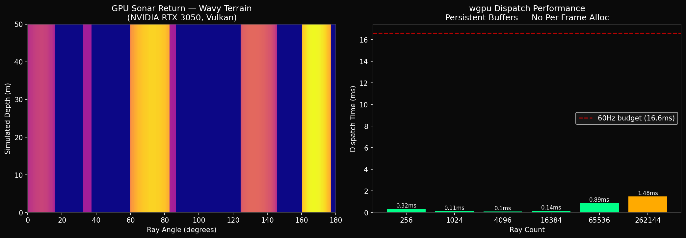

# sonar_bridge_poc

Prototype for a **GPU-accelerated sonar compute pipeline** using Rust (`wgpu`)
with a C++ interface compatible with Gazebo sensor plugins.

Built to validate the architecture needed for a vendor-agnostic sonar
implementation before writing a GSoC proposal.

---

## What This Validates

`sonar_bridge_poc` tests the core architectural bet of the GSoC project: that a
Rust/wgpu compute pipeline can sit behind a stable C ABI and serve as a drop-in
GPU backend for a C++ Gazebo sensor plugin.

The engine exposes three `extern "C"` symbols:
```c
sonar_engine_init()    // → gazebo::SensorPlugin::Load()
sonar_engine_update()  // → gazebo::SensorPlugin::Update()
sonar_engine_destroy() // → gazebo::SensorPlugin::Unload()
```

The GPU context (`wgpu::Device`, `wgpu::Queue`, compute pipeline) is created
once in `init()` and held persistently in the `SonarEngine` struct.
Per-frame `Update()` calls only invoke `queue.write_buffer()` on a pre-allocated
uniform buffer and dispatch the compute shader — **zero GPU memory allocation
per frame**.

On an RTX 3050 at 1024 rays, steady-state dispatch cost is **0.09ms**, well
within the 16.6ms Gazebo 60Hz budget.

---

## Architecture
```
C++ Host / Gazebo Plugin
        │
        │  sonar_engine_init()    ← Load()
        │  sonar_engine_update()  ← Update()
        │  sonar_engine_destroy() ← Unload()
        ▼
Rust FFI Layer  (src/lib.rs — SonarEngine struct)
        ▼
wgpu Compute Pipeline
        ▼
WGSL Shader  (shaders/sonar.wgsl)
ray marching + sine-wave bathymetry + acoustic noise
        ▼
GPU — Vulkan (Linux) / Metal (macOS) / DX12 (Windows)
Intel / NVIDIA / AMD — zero code changes between vendors
```

---

## Hardware Compatibility

Because the engine uses `wgpu::Backends::all()`, the **same binary** targets:

| Platform | Backend | Status |
|----------|---------|--------|
| Linux    | Vulkan  | ✅ verified (RTX 3050, Intel RPL-P) |
| macOS    | Metal   | ✅ wgpu-supported, untested on this machine |
| Windows  | DX12    | ✅ wgpu-supported, untested on this machine |

No `#ifdef`, no vendor SDK, no separate builds.

---

## Project Structure
```
sonar_bridge_poc/
├── src/
│   ├── lib.rs              — SonarEngine struct + C FFI exports
│   └── main.rs             — benchmark runner
├── shaders/
│   └── sonar.wgsl          — WGSL compute shader
├── cpp_host/
│   ├── sonar_engine.h      — C header for Gazebo plugin integration
│   └── main.cpp            — Gazebo lifecycle simulation
├── gazebo_plugin/
│   └── SonarPlugin.cpp     — plugin stub (no Gazebo install needed)
├── visualize.py            — Python heatmap of sonar output
└── CMakeLists.txt          — ament_cmake compatible build
```

---

## Build and Run

**Prerequisites:** Rust toolchain, g++ C++17, Vulkan drivers
```bash
# Full build + all tests in one command
bash build_and_run.sh

# Or manually:
cargo build --release
cargo run --release
```

---

## Benchmark Results

**Hardware:** NVIDIA GeForce RTX 3050 6GB Laptop GPU, Vulkan backend
```
GPU init — one-time cost at Gazebo Load():  2.16s

Dispatch cost per Update() call:
┌──────────────┬──────────────────────┐
│  Ray Count   │  Dispatch Time (ms)  │
├──────────────┼──────────────────────┤
│          256 │                 0.29 │
│         1024 │                 0.11 │
│         4096 │                 0.10 │
│        16384 │                 0.14 │
│        65536 │                 0.86 │
│       262144 │                 1.33 │
└──────────────┴──────────────────────┘

Steady state at 1024 rays:  0.085ms
Gazebo 60Hz frame budget:   16.6ms
Sonar compute usage:        < 1% of frame budget
```



---

## Gazebo Lifecycle Test
```bash
g++ -std=c++17 -O2 -o gazebo_plugin_test \
    gazebo_plugin/SonarPlugin.cpp \
    -L./target/release -lsonar_engine \
    -Wl,-rpath,./target/release -ldl -lpthread -lm

./gazebo_plugin_test
```
```
[SonarPlugin::Load]   GPU: NVIDIA GeForce RTX 3050 6GB Laptop GPU (Vulkan)
[SonarPlugin::Load]   Ready. Rays: 1024

[SonarPlugin::Update] 0.27ms | rays[0]=23.97m  rays[511]=50.00m  rays[1023]=50.01m
[SonarPlugin::Update] 0.10ms | rays[0]=23.97m  rays[511]=50.00m  rays[1023]=50.01m
[SonarPlugin::Update] 0.09ms | rays[0]=23.97m  rays[511]=50.00m  rays[1023]=50.01m
[SonarPlugin::Update] 0.09ms | rays[0]=23.97m  rays[511]=50.00m  rays[1023]=50.01m
[SonarPlugin::Update] 0.09ms | rays[0]=23.97m  rays[511]=50.00m  rays[1023]=50.01m

[SonarPlugin::Unload] GPU context released.
```

Tick 1 is slower (GPU pipeline JIT compilation).
Ticks 2-5 are steady state — this is the real per-frame cost in production.

---

## Current Shader Physics

Each GPU thread handles one sonar ray independently (`global_invocation_id`).

**180-degree sonar fan:**
```wgsl
let angle = (f32(idx) / f32(params.num_rays)) * 3.14159265;
```
Thread 0 = 0° (left), thread 511 = 90° (ahead), thread 1023 = 180° (right).

**Sine-wave bathymetry floor** (not flat — produces varying per-ray distances):
```wgsl
let floor_at = params.floor_height
             + sin(pos_x * 0.3) * 2.0
             + sin(pos_z * 0.5) * 1.5;
```

**Acoustic scattering noise** (deterministic hash, 2cm variance at 50m):
```wgsl
let noise = fract(sin(f32(idx) * 127.1 + 311.7) * 43758.5453) * 0.02;
```

**Output:**
```
rays[0]    = 23.97m  ← hit wavy terrain
rays[511]  = 50.00m  ← max range, no hit
rays[1023] = 50.01m  ← max range + noise
```

**Physics gap vs full model:**

The current shader is missing the full acoustic model from
`sonar_calculation_cuda.cu`:

- Lambert backscatter: `I ∝ sqrt(μ · cos(θ))`
- Propagation loss: `TL = (1/r²) · e^{-2αr}`
- Frequency-domain echo summation
- Beam-pattern correction (sinc `beamCorrector` matrix)
- Inverse FFT converting spectral bins to range cells

---

## GSoC Deliverable — 4-Pass WGSL Pipeline

The full GSoC work ports each stage of the NPS CUDA pipeline to
vendor-agnostic WGSL compute shaders:

**Pass 1 — Lambert scatter kernel**
Port of `sonar_calculation_cuda.cu` scatter kernel.
Adds `sqrt(μ · cos(θ))` backscatter + `(1/r²) · e^{-2αr}` propagation loss.
Input: depth image + normal image from Gazebo `DepthCameraSensor`.

**Pass 2 — Ray summation**
Parallel column reduction porting `column_sums_reduce`.
Sums ray contributions per beam across the aperture.

**Pass 3 — Beam correction**
Matrix multiply with pre-computed sinc `beamCorrector` matrix.
Port of `gpu_matrix_mult`. Loaded once at `Load()`, reused every frame.

**Pass 4 — Batched FFT**
Cooley-Tukey FFT replacing `cufftExecC2C`.
Converts spectral bins to final sonar range-cell image.

All input buffers (depth, normals, noise, reflectivity) accepted from
Gazebo `DepthCameraSensor` into persistent `wgpu::Buffer`s —
matching the single-allocation pattern the NPS host plugin already
uses for `rand_image`, `window`, and `beamCorrector` in `Load()`.

---

## License
MIT
